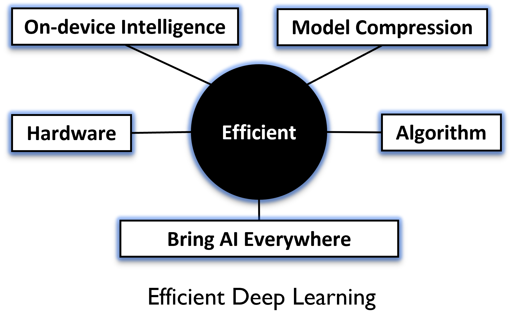

---
title: Efficient Deep Learning
summary: Deep learning has dramatically improved the state-of-the-art in self-driving cars, language models, games, science and many other domains. However, the large model size and computing requirements pose challenges for further market penetration. We target to improve the applicability of deep learning, by creating data efficient deep learnng models, and tremendously improving computational efficiency. 

date: "2017-08-27T00:00:00Z"

# Optional external URL for project (replaces project detail page).
external_link: ""
---
Deep learning has dramatically improved the state-of-the-art in self-driving cars, language models, games, science and many other domains. However, the large model size and computing requirements pose challenges for further market penetration. We target to improve the applicability of deep learning, by creating data efficient deep learnng models, and tremendously improving computational efficiency. This requires a comprehensive approach that combines the domains of machine learning and computer systems. More details can be found in our publications: [[CAL'18](https://www.computer.org/csdl/journal/ca/2018/02/08540899/17D45VObpO9), [ICCAD'18](https://ieeexplore.ieee.org/stamp/stamp.jsp?tp=&arnumber=8587764), [DATE'19](https://ieeexplore.ieee.org/abstract/document/8715195), [DATE'20](https://ieeexplore.ieee.org/abstract/document/9116494), [ICLR'20](https://openreview.net/forum?id=rygfnn4twS), [ICLR'21](https://openreview.net/forum?id=Cz3dbFm5u-), [IJCAI'21](https://www.ijcai.org/proceedings/2021/0472.pdf), [ASP-DAC'20](https://ieeexplore.ieee.org/abstract/document/9045333), [PACT'20 best paper nomination](https://dl.acm.org/doi/abs/10.1145/3410463.3414626), [ICLR'22a](https://openreview.net/forum?id=GWQWAeE9EpB), [ICLR'22b](https://openreview.net/forum?id=uPv9Y3gmAI5), [CVPR'22](https://scholar.google.com/citations?view_op=view_citation&hl=en&user=SBYgXLoAAAAJ&sortby=pubdate&citation_for_view=SBYgXLoAAAAJ:9ZlFYXVOiuMC)].

