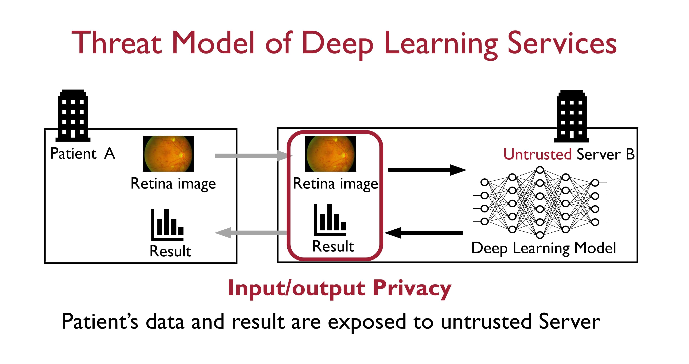
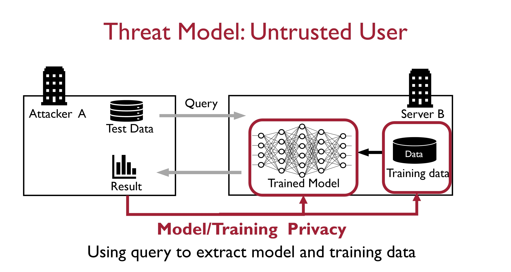
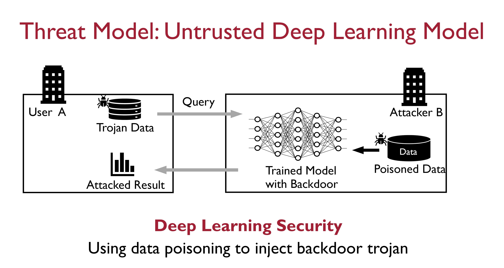

As Deep Learning systems are increasingly being deployed in real-world applications, it is critical to ensure that these systems are behaving responsibly and are trustworthy.  Current policies and regulations also urge to develop and deploy ML models and algorithms that are not only accurate, but also secure, privacy-preserving, transparent, and robust.  In particular, my current research focus on privacy-preserving deep learning. There are two threat models that are studied by my research. 
More details can be found in our publications: [[NeurIPS'19](https://papers.nips.cc/paper/2019/file/56a3107cad6611c8337ee36d178ca129-Paper.pdf), [NeurIPS'20a](https://proceedings.neurips.cc/paper/2020/hash/685ac8cadc1be5ac98da9556bc1c8d9e-Abstract.html), [NeurIPS'20b](https://papers.nips.cc/paper/2020/file/6244b2ba957c48bc64582cf2bcec3d04-Paper.pdf), [NeurIPS'20c](https://papers.nips.cc/paper/2020/file/18fc72d8b8aba03a4d84f66efabce82e-Paper.pdf), [CCS PPMLP'20](http://sci-workshops.alipay.com/CCS2020), [ICLR'21](https://openreview.net/forum?id=Cz3dbFm5u-), [ICML'21](https://arxiv.org/pdf/2106.00038.pdf), [EMNLP'21](https://arxiv.org/abs/2010.11796), [DATE'22](https://github.com/paper-link/unpublished-paper/blob/main/DATE2022-coxHE.pdf)].

I recently study the backdoor attack of deep learning models. One attack example is shown as follows. 

